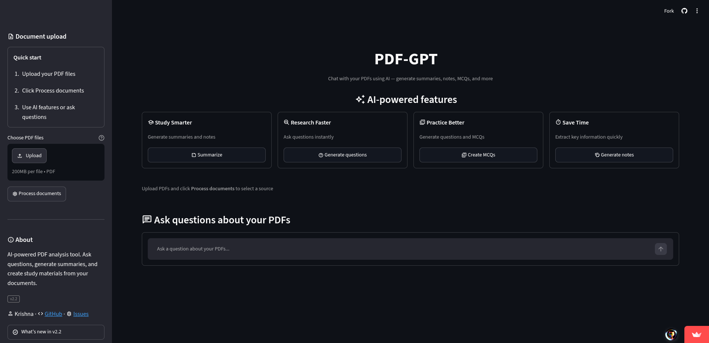
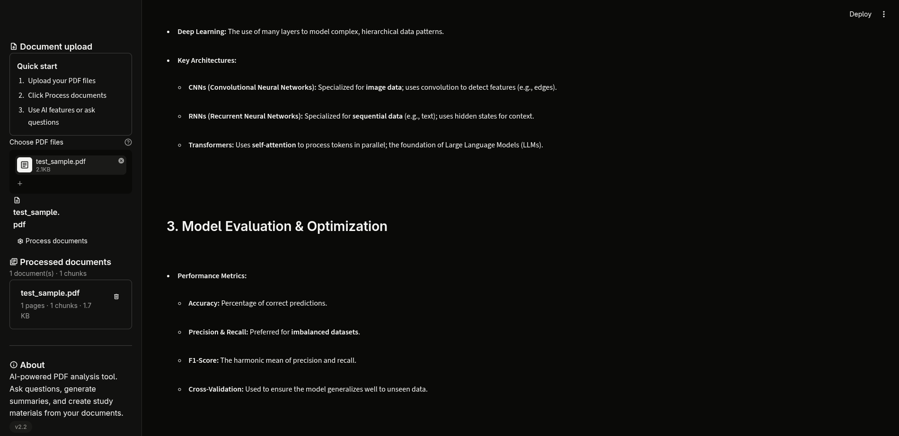
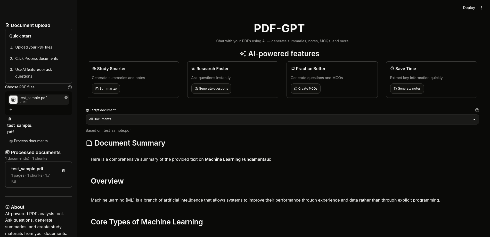
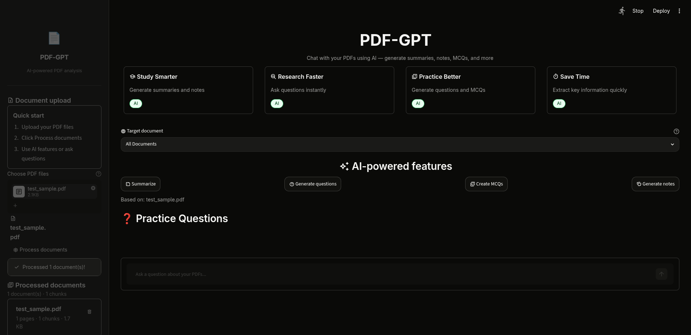

# PDF-GPT — AI-Powered PDF Analysis Platform

[](https://pdfgpt0.streamlit.app/)
[](https://python.org)
[](LICENSE)

> **A full-featured RAG application** — upload PDFs, ask questions, generate summaries, MCQs, and study notes using Google Gemini + hybrid search + OCR for scanned documents.

## Screenshots

| Home Page | Study Notes |
|---|---|
|  |  |

| Summary & Comparison | Thinking Indicator |
|---|---|
|  |  |

[View live app →](https://pdfgpt0.streamlit.app/)

---

## Table of Contents

- [Features](#features)
- [Architecture](#architecture)
- [Tech Stack](#tech-stack)
- [Quick Start](#quick-start)
- [Usage Guide](#usage-guide)
- [What Makes This Unique](#what-makes-this-unique)
- [Screenshots](#screenshots)
- [Project Structure](#project-structure)
- [Deployment](#deployment)
- [Troubleshooting](#troubleshooting)

---

## Features

### Core RAG Pipeline
| Feature | Detail |
|---|---|
| **Hybrid Search** | BM25 keyword search + FAISS vector similarity fused via Reciprocal Rank Fusion (RRF). Catches both semantic matches and exact keyword hits. |
| **LLM Reranker** | Gemini re-scores top-k hybrid results for precision. Only the most relevant chunks reach the LLM. |
| **Streaming Responses** | Token-by-token animated output with markdown and LaTeX MathJax rendering. |
| **Conversation Memory** | Last 3 Q&A exchanges injected as context — supports follow-up questions. |
| **Multi-Document Management** | Upload multiple PDFs, view per-doc metadata, remove individual documents, filter search to specific files. |
| **OCR for Scanned PDFs** | Detects image-based PDFs and routes to Gemini Vision for text extraction. Badge indicator shows which docs used OCR. |
| **Local Embeddings Fallback** | FastEmbed (ONNX-based, BAAI/bge-small) runs locally with no GPU — works even when Google API quota is exhausted. |

### Study Tools
| Tool | Description |
|---|---|
| **Summarize** | Generates structured document summaries with key points. |
| **Generate Questions** | Creates thoughtful questions with detailed answers. |
| **Create MCQs** | Multiple-choice questions with 4 options and correct answers. |
| **Generate Notes** | Concise study notes extracted from document content (supports 2-column layout). |
| **Export** | Download any generated content as a text file. |

### UI / UX
- **Dark theme** — shadcn zinc palette, Inter font, smooth transitions
- **Material Symbol icons** throughout (no emojis)
- **Responsive layout** — `st.container(horizontal=True)`, `vertical_alignment`, proper spacing
- **Processing status** — `st.status()` with step-by-step progress updates
- **Empty state** — placeholder card when no documents loaded
- **Custom CSS** — hover effects, custom scrollbar, file uploader styling, input focus rings

---

## Architecture

```
┌──────────────────────────────────────────────────────────┐
│                   Streamlit Frontend                      │
│  (Theme: shadcn zinc · Material Icons · Custom CSS)      │
└──────────────────┬───────────────────────────────────────┘
                   │
                   ▼
┌──────────────────────────────────────────────────────────┐
│                 Document Processing                       │
│                                                           │
│  PDF Upload ───▶ Scanned? ──▶ PyPDF2 / Gemini Vision    │
│                        │                                 │
│                        ▼                                 │
│           RecursiveCharacterTextSplitter                  │
│           (per-document metadata tracking)                │
└──────────────────┬───────────────────────────────────────┘
                   │
                   ▼
┌──────────────────────────────────────────────────────────┐
│              Hybrid Search Pipeline                       │
│                                                           │
│  ┌──────────┐    ┌──────────┐    ┌──────────┐           │
│  │  BM25    │    │  FAISS   │    │  Rerank  │           │
│  │(keyword) │    │(vector)  │    │ (Gemini) │           │
│  └────┬─────┘    └────┬─────┘    └────┬─────┘           │
│       │               │               │                  │
│       └───────┬───────┘               │                  │
│               ▼                        │                  │
│         RRF Fusion                     │                  │
│               │                        │                  │
│               └───────────┬────────────┘                  │
│                           ▼                               │
│                   Top-k Results                           │
└──────────────────┬───────────────────────────────────────┘
                   │
                   ▼
┌──────────────────────────────────────────────────────────┐
│                    Gemini LLM                             │
│                                                           │
│  • Q&A with context                                      │
│  • Summarization                                         │
│  • Question/MCQ generation                                │
│  • Note generation                                        │
│  • Streaming + Markdown + LaTeX rendering                 │
└──────────────────────────────────────────────────────────┘
```

### Data Flow
1. **Upload** → PDFs are read (PyPDF2 for text, Gemini Vision for scanned)
2. **Chunk** → Text split into overlapping chunks with source metadata
3. **Index** → BM25 index built + FAISS vector store created with `FastEmbedEmbeddings`
4. **Query** → Hybrid search (BM25 + FAISS) → RRF fusion → Gemini reranker
5. **Generate** → Top chunks + prompt → Gemini LLM → streamed markdown output
6. **Render** → Markdown converted to HTML server-side → injected into styled div

---

## Tech Stack

| Layer | Technology |
|---|---|
| **Frontend** | Streamlit 1.58 · shadcn zinc theme · Custom CSS · Material Symbols |
| **PDF Parsing** | PyPDF2 · pdf2image · Google Gemini Vision (OCR) |
| **Text Processing** | LangChain text splitters · Markdown 3.10 |
| **Vector Search** | FAISS (CPU) · `BAAI/bge-small` embeddings via FastEmbed |
| **Keyword Search** | BM25 (rank-bm25) |
| **Reranker** | Gemini relevance scoring |
| **LLM** | Google Gemini (via google-genai SDK) |
| **Config** | python-dotenv |
| **Streaming** | Server-side markdown→HTML → `st.markdown(unsafe_allow_html=True)` |

---

## Quick Start

### Prerequisites
- Python 3.10+
- Google AI API key ([get one free](https://makersuite.google.com/app/apikey))
- `poppler-utils` for OCR (Linux: `sudo apt install poppler-utils`, macOS: `brew install poppler`)

### Setup

```bash
# Clone
git clone https://github.com/krishnak2c/PDF-GPT.git
cd PDF-GPT

# Create virtual environment
python -m venv .venv
source .venv/bin/activate        # Linux/macOS
# .venv\Scripts\activate         # Windows

# Install dependencies
pip install -r requirements.txt

# Configure API key
cp .env.example .env
# Edit .env → set your GOOGLE_API_KEY
```

### Run

```bash
streamlit run app.py
```

Open [http://localhost:8501](http://localhost:8501).

---

## Usage Guide

### 1. Upload Documents
- Click **Document upload** in the sidebar
- Select one or more PDF files (text-based or scanned)
- Click **Process documents** — status updates appear as steps

### 2. Ask Questions
- Type a question in the chat input and press Enter
- The app runs hybrid search across all (or selected) documents
- Response streams token-by-token with markdown formatting

### 3. Generate Study Materials
- Click any feature button: **Summarize**, **Generate questions**, **Create MCQs**, **Generate notes**
- Results appear in styled output boxes
- Download any output as a `.txt` file

### 4. Manage Documents
- View processed documents in the sidebar
- Remove individual documents with the delete button
- Filter answers to specific documents using the **Target document** dropdown

---

## What Makes This Unique

PDF-GPT goes beyond a standard RAG tutorial clone:

| Differentiator | Why It Matters |
|---|---|
| **Hybrid search (BM25 + FAISS)** | Most RAG apps use vector-only search. Hybrid catches exact keyword matches and semantic similarity. |
| **OCR pipeline** | Works with scanned textbooks and image-based PDFs — not just text PDFs. |
| **Local embedding fallback** | FastEmbed runs locally with no GPU. App works even when Google API quota is exhausted. |
| **LLM reranker** | Gemini re-ranks retrieval results for higher answer precision. |
| **Study tools** | Summaries, questions, MCQs, and notes — not just Q&A. |
| **Multi-document management** | Per-document tracking, removal, and source filtering. |
| **LaTeX math rendering** | MathJax integration for technical/academic PDFs. |
| **Conversation memory** | Follow-up questions work naturally. |
| **Streaming + markdown** | Animated output with proper formatting. |
| **Production-grade UI** | Custom theme, Material icons, responsive layout, status indicators. |

---

## Project Structure

```
PDF-GPT/
├── app.py                   # Main application (1317 lines)
├── requirements.txt         # Pinned dependencies
├── .env.example             # Environment config template
├── .streamlit/
│   ├── config.toml          # shadcn zinc dark theme
│   └── style.css            # Custom CSS (207 lines)
├── .gitignore
└── README.md
```

Single-file design (`app.py`) keeps deployment simple — no multi-file imports to break.

---

## Deployment

### Streamlit Community Cloud
1. Push to GitHub
2. Go to [share.streamlit.io](https://share.streamlit.io)
3. Select repo, main file: `app.py`
4. Add secrets in Settings → Secrets:
   ```toml
   GOOGLE_API_KEY = "your_key"
   GEMINI_MODEL = "gemini-2.0-flash"
   ```

### Render
[](https://render.com/deploy)

Start command:
```bash
streamlit run app.py --server.address=0.0.0.0 --server.port=$PORT
```

---

## Troubleshooting

| Problem | Solution |
|---|---|
| `GOOGLE_API_KEY` not found | Create `.env` file with your key (see `.env.example`) |
| PDF has no text | The file may be scanned/image-only. OCR kicks in automatically. |
| `poppler-utils` not found | Install it: `sudo apt install poppler-utils` (Linux), `brew install poppler` (macOS) |
| Google API quota exhausted | The app falls back to local FastEmbed embeddings automatically. |
| Large PDF processing | Apps on free Streamlit Cloud have memory limits. Split large PDFs. |

---

## License

MIT License — see [LICENSE](LICENSE).

---

<p align="center">
  Built with Streamlit · LangChain · FAISS · Google Gemini<br>
  <a href="https://github.com/krishnak2c/PDF-GPT">GitHub</a> ·
  <a href="https://github.com/krishnak2c/PDF-GPT/issues">Report Issue</a>
</p>
